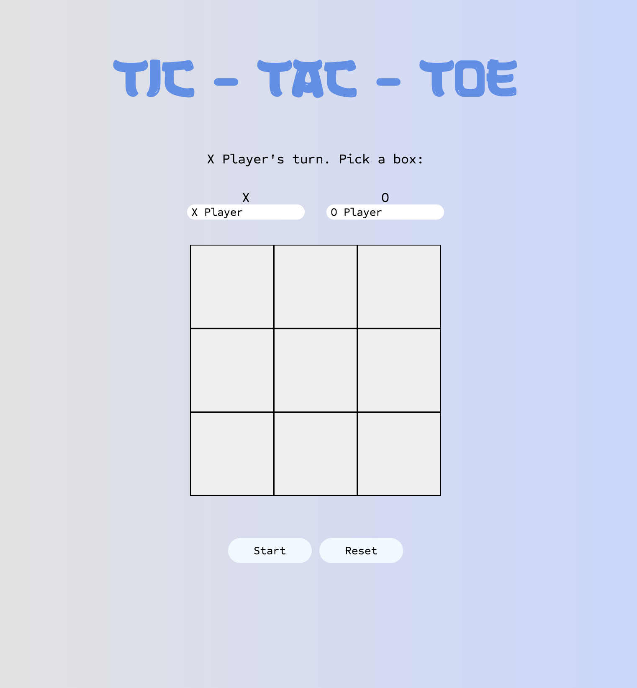

# tic-tac-toe
A Tic-Tac-Toe game which you can play in your browser.

Live  👉 https://dylewskii.github.io/tic-tac-toe/

## Focus Points: 
- To have as little global code as possible. 
- Use Modules/Factories.

## Final Outcome:

## Languages used:

-    
-    
- 

## Future TODO:
- Create an AI so that a player can play against the computer.

## Credits:
Fonts [Licensed As Freeware, Non-Commercial] - https://www.fontspace.com/samurai-blast-font-f94192